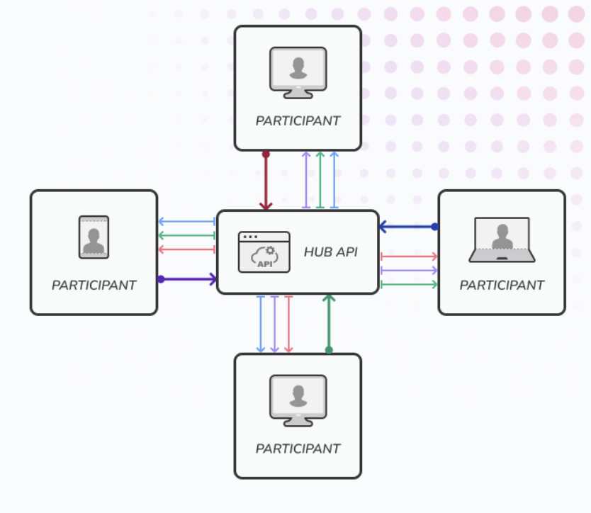

{: .box-success}
A design exploration for a web-based live streaming project built around WebCodec and custom HTTP transport.


**Context: I need to build a web-based video conference that supports screen sharing.**

---
## Why Another Design?

In this post, I want to discuss a live conference architecture built on **HTTP** and **WebCodec**. By *web*, I mean technologies that run natively in the browser—no plugins, no native dependencies.

Live conferences are fundamentally about real-time audio and video. Behind the scenes, this involves:
- **Networking** — delivering data reliably (or timely) across the Internet
- **Codecs** — compressing raw media into efficient streams
- **Quality control** — adapting to bandwidth and packet loss

A typical multiparty meeting may adopt a mesh topology like this:

```
          Alice
         /     \
        /       \
       /         \
     Bob ------- Carol
```

In WebRTC, this is called **P2P (Peer-to-Peer)**. It works well in theory, but in practice it introduces several challenges:
- Each peer must discover the other’s public IP and port via a **STUN** server
- If NAT traversal fails, a **TURN** server relays the traffic
- ICE signaling requires an additional server to exchange session descriptions
- Most WebRTC implementations do **not** reuse UDP sockets efficiently, leading to high resource consumption

---

## WebRTC vs. SFU vs. RTSP/RTMP

A more scalable alternative is the **SFU (Selective Forwarding Unit)** pattern, where each client pushes its stream to a central server, which then forwards copies to all other participants:



This is conceptually similar to RTSP/RTMP streaming, but those protocols are **not allowed in browsers** due to security restrictions.

To view RTSP/RTMP streams on the web, one common workaround is to **remux** them into **HLS** or **MPEG-DASH**—formats that the browser can play via `<video>` or MSE (Media Source Extensions). However, this approach comes with heavy costs:

1. **Multiple data copies** — depacketizing RTP into raw H.264, then repacketizing into fragmented MP4. This increases latency and CPU load.
2. **GOP-level buffering** — HLS/DASH require at least one full GOP (Group of Pictures) before playback, which typically adds 1–2 seconds of delay. This is **unacceptable** for interactive use cases like drones, cars, or teleoperation.
3. **Packet loss sensitivity** — reordering or loss during remuxing can corrupt the output, requiring complex integrity handling.

---

## So What’s the Current State of Web Media?

- **WebRTC** is powerful but complex (multiple servers, high socket usage, black-box internals)
- **HLS/DASH** is reliable but high-latency, suitable only for *watching*, not *interacting*
- **WebCodecs** (which we’ll explore below) is a new browser API that exposes codec primitives, giving developers fine-grained control over encoding/decoding

> It seems there is no single "perfect" web conference protocol today—we either inherit from mature but heavy frameworks, or trade off latency and control.

---

## Enter WebCodecs: A Developer-Friendly Codec API

[WebCodecs](https://www.w3.org/TR/webcodecs/) is a game-changer. It exposes low-level video/audio encoder/decoder interfaces directly to JavaScript, without hiding them behind proprietary black boxes like WebRTC.

Examples are available [here](https://w3c.github.io/webcodecs/samples/), and the codec support list is maintained [here](https://www.w3.org/TR/2026/DRY-webcodecs-codec-registry-20260212/).

This gives developers the ability to:
- Encode raw frames from camera/screen capture
- Decode incoming streams at the frame level
- Build custom streaming logic—retransmission, prioritization, adaptive bitrate, etc.

Combined with modern web primitives like `WritableStream`, we have the building blocks for a fully custom media pipeline.

---

## The Missing Piece: A Transport Protocol

We now have codec control, but we still lack a transport protocol tailored to WebCodecs:

- It must handle **stream integrity**, loss recovery, and reordering
- It should be HTTP-friendly (firewalls, load balancers, proxies)
- It should support fallback to TCP when HTTP/3 (QUIC) is unavailable

**HTTP/3 + QUIC** is ideal—it provides multiplexing, low-latency, and native stream abstraction. However, not all infrastructure supports it yet. So we need a fallback.

### Proposed Design: HTTP + WebCodec + Intelligent Fallback

Our protocol supports both **HTTP/3 (QUIC)** and **HTTP/2/1.1 with keep-alive** as fallback. In case of head-of-line blocking over TCP, we can:
- Switch to a lower-quality stream
- Or open **multiple TCP connections** for different media feeds

A typical session might look like this:

```
                             SERVER
══════════════════════════════════════════════════════════════════════

                 +--------------------------------+
                 |     Media Scheduler (MTL)      |
                 |--------------------------------|
                 | Frame Window                   |
                 | Frame Database                 |
                 | GOP Dependency Graph           |
                 | Path Scheduler                 |
                 | Quality Controller             |
                 +--------------------------------+
                   │        │        │        │
         HTTP #1   │ HTTP #2│ HTTP #3│ RTCP-like
───────────────────┼────────┼────────┼──────────────
                   │        │        │
                   ▼        ▼        ▼
          TCP1          TCP2          TCP3          TCP4
══════════════════════════════════════════════════════════════════════
                              NETWORK
══════════════════════════════════════════════════════════════════════
```

The client side similarly maintains multiple TCP streams, each carrying a separate feed. A **control channel** (RTCP-like) handles feedback and retransmission requests:

```
══════════════════════════════════════════════════════════════════════
                              NETWORK
══════════════════════════════════════════════════════════════════════
          TCP1          TCP2          TCP3          TCP4

HTTP Conn1      HTTP Conn2      HTTP Conn3      Control Conn
     │               │               │               ▲
     └──────┬────────┴───────────────┘               │
            ▼                                        │
     +----------------------------------------------+
     |          Frame Reassembler                    |
     +----------------------------------------------+
                     │
                     ▼
          +-------------------------+
          | Receiver Window         |
          |-------------------------|
          |100 ✓                    |
          |101 ✓                    |
          |102 ✗                    |
          |103 ✓                    |
          |104 ✓                    |
          +-------------------------+
                     │
           Missing Frame Detector
                     │
                     ▼
             RTCP-like Feedback
                     │
                     ▲
       Request Frame102 via other TCPs
                     │
                     ▲
     Drop blocking TCP, starting new ones
```

This hybrid approach shares characteristics with **QUIC + WebRTC**, but remains lightweight and HTTP-accessible. It works well under moderate network conditions, but may struggle in highly lossy environments—choose wisely based on your use case.

---

## Custom Frame Format: Tailored for WebCodecs

Traditional RTP packets are designed around UDP MTU (~1500 bytes), with complex fragmentation schemes for H.264 (e.g., [RFC 6184](https://datatracker.ietf.org/doc/html/rfc6184)).

For a WebCodecs-based pipeline, we want something simpler and more aligned with the browser’s expectations. The most critical piece is the **codec configuration string** defined in [RFC 6381](https://datatracker.ietf.org/doc/html/rfc6381). For example:

```javascript
const encoderConfig = {
  codec: "avc1.4d4028",
  width: 800,
  height: 600,
  framerate: 30,
  avc: { format: "annexb" }
};
```

This string tells the browser which codec, profile, and level to use. Our custom protocol defines four main frame types:

| Type | Name | Description |
|------|------|-------------|
| `vcnf` | Video Configuration | Codec init data for video |
| `acnf` | Audio Configuration | Codec init data for audio |
| `vfrm` | Video Frame | Encoded H.264/H.265/VP9 data |
| `afrm` | Audio Frame | Encoded AAC/Opus data |

Each frame is prefixed with a simple binary header, and multiple TCP connections carry different feeds. Video frames (`vfrm`) support fragmentation, so large IDR frames can be split across packets.

Here are the detailed packet structures:

**`vcnf` — Video Configuration**
```
+------------------------------------------------+
| SEP (Start of Frame)                            |
+------------------------------------------------+
| BoxName = "vcnf"                                |
+------------------------------------------------+
| PayloadLen                                      |
+------------------------------------------------+
| Width (uint16)                                  |
+------------------------------------------------+
| Height (uint16)                                 |
+------------------------------------------------+
| CodecLen (uint16)                               |
+------------------------------------------------+
| RFC6381 Codec String                            |
+------------------------------------------------+
| ExtraDataLen (uint32)                           |
+------------------------------------------------+
| AVC/HEVC Extradata (e.g., SPS/PPS)              |
+------------------------------------------------+
```

**`acnf` — Audio Configuration**
```
+------------------------------------------------+
| SEP                                             |
+------------------------------------------------+
| BoxName = "acnf"                                |
+------------------------------------------------+
| PayloadLen                                      |
+------------------------------------------------+
| CodecType String (RFC6381)                      |
+------------------------------------------------+
| Codec Extradata (if any)                       |
+------------------------------------------------+
```

**`afrm` — Audio Frame**
```
+------------------------------------------------+
| SEP                                             |
+------------------------------------------------+
| BoxName = "afrm"                                |
+------------------------------------------------+
| PayloadLen                                      |
+------------------------------------------------+
| FEED (uint32) — feed identifier                |
+------------------------------------------------+
| Sequence (uint32)                               |
+------------------------------------------------+
| Timestamp (uint64) — media time                |
+------------------------------------------------+
| FrameID (uint64) — unique frame ID             |
+------------------------------------------------+
| Duration (uint32) — sample duration            |
+------------------------------------------------+
| Payload (encoded audio data)                   |
+------------------------------------------------+
```

**`vfrm` — Video Frame (with fragmentation support)**
```
+------------------------------------------------+
| SEP                                             |
+------------------------------------------------+
| BoxName = "vfrm"                                |
+------------------------------------------------+
| PayloadLen                                      |
+------------------------------------------------+
| FEED (uint32)                                   |
+------------------------------------------------+
| Sequence (uint32)                               |
+------------------------------------------------+
| Timestamp (uint64)                              |
+------------------------------------------------+
| FrameID (uint64)                                |
+------------------------------------------------+
| FragmentID (uint16)                             |
+------------------------------------------------+
| FragmentCount (uint16)                          |
+------------------------------------------------+
| FrameType (uint8)                               |
|   0 = IDR, 1 = P, 2 = B                        |
+------------------------------------------------+
| DependencyID (uint64) — reference frame        |
+------------------------------------------------+
| Duration (uint32)                               |
+------------------------------------------------+
| PayloadLen (uint32)                             |
+------------------------------------------------+
| NAL Payload (encoded video data)               |
+------------------------------------------------+
```

This format is lightweight, easily parsed, and works well with WebCodecs’ `EncodedVideoChunk` and `EncodedAudioChunk` APIs.

---

## Implementation Notes

We plan to implement the server in **Rust** using [Tokio](https://docs.rs/tokio/latest/tokio/), which supports `SO_REUSEPORT` and efficient epoll-based I/O. This allows us to scale to many concurrent participants more easily than WebRTC’s peer-peer socket model.

The client will use the browser’s native `VideoEncoder`, `VideoDecoder`, `AudioEncoder`, and `AudioDecoder`, feeding them with our custom packets.

---

## Summary

We’ve designed a live conference system that combines:
- **WebCodecs** for flexible, low-latency encoding/decoding in the browser
- **HTTP/3 (QUIC)** with fallback to HTTP/2 or keep-alive TCP
- **Custom frame formats** tailored for the browser, not legacy RTP
- **Multiple TCP streams** for better parallelism and tolerance of head-of-line blocking

This design is not ideal for extremely poor networks, but it works well for environments where HTTP/3 or reliable TCP is available. It gives developers full control over the media pipeline without the complexity or black-box nature of WebRTC.

If this resonates with you, feel free to contribute ideas, improvements, or even a PR to the [Webtalk](https://github.com/shiqifeng2000/Webtalk) repo. Let’s build the next generation of web-native conferencing together.

---

*Happy coding — and stay real-time.*